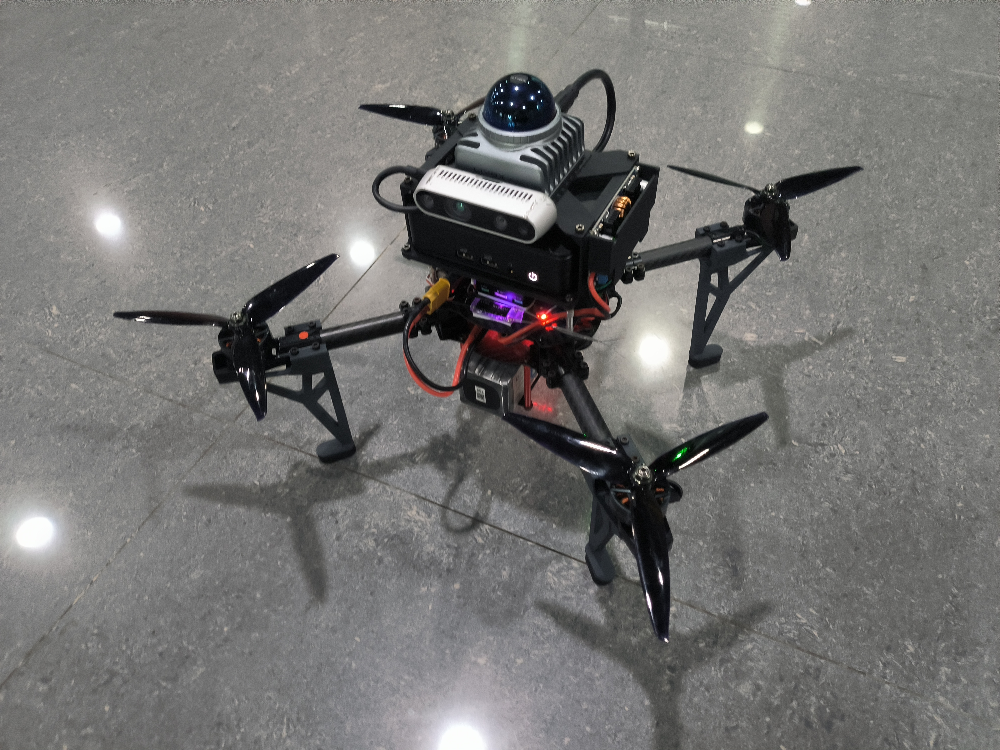

# Fly-Ego

基于 [NEU-REAL/REAL_DRONE_400](https://github.com/NEU-REAL/REAL_DRONE_400) 做的个人二次开发与实机部署项目，目标是完成一套面向 400 级四旋翼平台的自主飞行方案。

这个仓库不是从零原创的算法项目，而是我在原开源方案基础上，结合自己的硬件配置、传感器方案和实飞需求做的工程化整合、裁剪、调参和部署记录。当前版本主要围绕 `PX4 + MAVROS + Livox MID360 + FAST-LIO + EGO-Planner` 展开。



## 项目定位

我把这个仓库作为自己的无人机项目实践记录，重点不在“重新发明全部算法”，而在于把开源方案真正落到一台可装配、可联调、可起飞、可规划的实机平台上。

当前整理的内容包括：

- 400 级无人机平台的结构与装配资料
- 飞控、机载算力、雷达/深度感知链路的部署整理
- 基于 `FAST-LIO` 的建图与高频里程计输出
- 基于 `EGO-Planner` 的实机避障规划流程
- `px4ctrl` 参数、起降流程和启动脚本的适配
- 实机调试时使用的图片、硬件文件和辅助脚本

## 我做的工作

相对原始开源项目，这个版本主要记录了我自己的二次开发和适配工作：

- 按自己的平台配置整理了一套可直接联调的目录结构和启动脚本
- 将感知和定位链路对接到 `Livox MID360` 与 `FAST-LIO`
- 在规划侧使用 `/cloud_registered` 和 `/Odom_high_freq` 作为实机输入
- 调整 `px4ctrl` 相关参数以适配当前机体重量、起飞高度和悬停油门
- 精简掉当前方案未继续使用的部分模块，保留更贴近自己实机方案的实现
- 补充了结构件、装配图、照片、采购表和 STEP/3MF 设计文件，便于复现硬件方案

如果你是招聘方、老师或项目合作者，可以把它理解成：
这是一个“基于成熟开源无人机方案进行工程落地和二次开发”的个人项目，而不是对上游来源做模糊处理的完全原创声明。

## 系统组成

项目当前涉及的关键模块：

- 飞控链路：`PX4`、`MAVROS`
- 控制模块：`src/realflight_modules/px4ctrl`
- 建图定位：`src/realflight_modules/FAST_LIO`
- 规划模块：`src/planner/plan_manage`
- 仿真与工具：`src/uav_simulator`、`src/utils`
- 硬件资料：`release/`、`files/`、`misc/`

## 目录说明

- `src/`：ROS 工作空间源码
- `home_shfiles/`：常用启动脚本
- `files/`：采购清单和外设资料
- `misc/`：实物图片、参数截图和装配过程图
- `release/`：结构件与整机设计文件，包含 `STEP`、`3MF` 和生产资料

## 运行流程

以下脚本反映了我当前实机联调时的基本流程：

```bash
# 1. 启动飞控通信和 MID360 驱动
sh start_sensor.sh

# 2. 启动 FAST-LIO 建图/定位
sh start_mapping.sh

# 3. 启动规划
sh start_planner.sh

# 4. 启动控制器
sh start_run_ctrl.sh

# 5. 自动起飞
sh start_takeoff.sh

# 6. 自动降落
sh start_land.sh
```

规划侧当前主要使用：

- 点云输入：`/cloud_registered`
- 高频里程计：`/Odom_high_freq`

这套流程更偏向我自己的实机环境，不保证直接适用于其他硬件组合。

## 开发环境

仓库内容主要面向 Linux 下的 ROS1/Catkin 工作流，常见依赖包括：

- Ubuntu
- ROS
- Catkin
- PX4
- MAVROS
- Livox 驱动
- FAST-LIO
- EGO-Planner

仓库中保留了 `build/` 和 `devel/` 的本地构建痕迹，但这些内容不属于应当提交的源码本体。

## 项目说明与致谢

本仓库基于以下开源工作继续整理和修改：

- 上游项目：<https://github.com/NEU-REAL/REAL_DRONE_400>
- 相关规划方案：EGO-Planner
- 相关建图定位方案：FAST-LIO
- 相关飞控控制基础：PX4 / MAVROS / px4ctrl

这里展示的是我在开源基础上的二次开发成果、调试记录和工程整合经验。上游项目与相关算法仓库的作者应得到明确致谢与保留引用。
